# Simul ERD (Entity-Relationship Diagram)

> **기준 문서**: `simul-functional-spec.md`, `simul-api-spec.md`, `simul-backend-architecture.md`  
> **기능 변경 반영 목록**: 가상 시착용 베이스 사람 이미지(`base_images`) 영구 보관 및 AI 시착 결과를 베이스 이미지로 재사용하는 순환 로직 추가. 소셜 로그인 중복 방지, 팔로우 중복 방지, 수동 게시물 지원을 위한 제약 조건 보완. **다중 이미지 게시물(`post_images`) 지원, Google Vision API 기반 자동 태그(`tags`, `post_tags`) 시스템, 통합 검색 기능 추가.**

## 시각화 다이어그램 (Mermaid)
이 다이어그램은 Github Markdown이나 최신 Markdown 뷰어에서 자동으로 다이어그램 맵으로 변환되어 출력됩니다.

```mermaid
erDiagram
    users {
        UUID user_id PK
        ENUM provider "kakao, naver, google, email"
        VARCHAR provider_id
        UNIQUE provider_provider_id "(provider, provider_id)"
        VARCHAR nickname
        VARCHAR bio
        TEXT profile_image_url
        BOOLEAN is_public "DEFAULT true"
        ENUM role "user, admin"
        BOOLEAN is_active "DEFAULT true (정지 여부)"
        TIMESTAMP created_at
        TIMESTAMP deleted_at "nullable (소프트 딜리트)"
    }

    base_images {
        UUID base_image_id PK
        UUID user_id FK
        TEXT image_url
        UUID source_post_id FK "nullable (기존 시착 결과를 재사용한 경우 출처)"
        TIMESTAMP created_at
        TIMESTAMP deleted_at
    }

    clothing_images {
        UUID image_id PK
        TEXT image_url
        UUID uploader_id FK "최초 업로더"
        TIMESTAMP created_at
    }

    closet_items {
        UUID item_id PK
        UUID user_id FK
        UUID image_id FK
        ENUM category "top, bottom, outer, shoes, accessory"
        VARCHAR memo
        INT try_count
        TIMESTAMP created_at
        TIMESTAMP deleted_at
    }

    posts {
        UUID post_id PK "시착 잡의 job_id 공유"
        UUID user_id FK
        UUID base_image_id FK "nullable (시착에 사용한 내 몸 베이스 사진, 수동 게시물은 null)"
        UUID item_id FK "nullable (시착 원본 옷 출처)"
        TEXT image_url "nullable (대표 이미지, 처리 전 null)"
        ENUM status "processing, completed, failed"
        VARCHAR caption "nullable"
        BOOLEAN is_public "DEFAULT false (비공개 우선)"
        BOOLEAN is_blinded "DEFAULT false (신고 누적 자동 블라인드)"
        INT report_count "DEFAULT 0"
        INT like_count
        INT view_count
        TIMESTAMP created_at
        TIMESTAMP deleted_at
    }

    post_images {
        UUID post_image_id PK
        UUID post_id FK "게시물 참조"
        TEXT image_url "이미지 URL"
        INT sort_order "정렬 순서 (0부터)"
        TIMESTAMP created_at
    }

    tags {
        UUID tag_id PK
        VARCHAR name "UNIQUE, 태그명 (예: 데님, 니트, 캐주얼)"
        VARCHAR category "nullable (상의, 하의, 아우터, 스타일 등)"
        INT usage_count "DEFAULT 0 (사용 빈도, 검색 자동완성용)"
        TIMESTAMP created_at
    }

    post_tags {
        UUID post_tag_id PK
        UUID post_id FK "게시물 참조"
        UUID tag_id FK "태그 참조"
        UNIQUE post_id_tag_id "(post_id, tag_id)"
        TIMESTAMP created_at
    }

    tryon_credits {
        UUID credit_id PK
        UUID user_id FK
        TIMESTAMP used_at
        UUID job_id FK "references posts.post_id"
    }

    comments {
        UUID comment_id PK
        UUID post_id FK
        UUID user_id FK
        UUID parent_comment_id FK "nullable (대댓글)"
        INT depth "1 or 2"
        VARCHAR content "max: 200"
        TIMESTAMP created_at
        TIMESTAMP deleted_at
    }

    follows {
        UUID follow_id PK
        UUID follower_id FK "references users"
        UUID following_id FK "references users"
        TIMESTAMP created_at
        UNIQUE follower_following "(follower_id, following_id)"
    }

    likes {
        UUID like_id PK
        UUID post_id FK
        UUID user_id FK
        TIMESTAMP created_at
        UNIQUE post_id_user_id "(post_id, user_id)"
    }

    reports {
        UUID report_id PK
        UUID post_id FK
        UUID reporter_id FK "references users"
        VARCHAR reason
        TIMESTAMP created_at
        UNIQUE post_id_reporter_id "(post_id, reporter_id)"
    }

    notifications {
        UUID notification_id PK
        UUID recipient_id FK "알림 수신자 (references users)"
        UUID actor_id FK "nullable, 알림 발생자 (references users)"
        ENUM type "TRYON_COMPLETE, LIKE, COMMENT, FOLLOW_POST"
        UUID reference_id "nullable, 관련 리소스 ID (post_id 등)"
        VARCHAR message "알림 메시지 (최대 200자)"
        BOOLEAN is_read "DEFAULT false"
        TIMESTAMP created_at
    }

    %% Relationships
    users ||--o{ base_images : "registers (모델 샷 등록)"
    users ||--o{ clothing_images : "uploads (최초 등록)"
    users ||--o{ closet_items : "owns (옷장 보관)"
    clothing_images ||--o{ closet_items : "mapped_to (옷장 복사본 연결)"
    
    users ||--o{ posts : "creates_or_tryon (시착 등록 및 피드)"
    base_images ||--o{ posts : "used_as_model (시착 모델로 사용)"
    posts |o--o{ base_images : "converted_to_model (AI 결과를 다시 모델로 사용)"
    closet_items |o--o{ posts : "used_in_tryon (입어본 옷 출처 연결)"
    
    posts ||--o{ post_images : "has_images (다중 이미지)"
    posts ||--o{ post_tags : "has_tags (게시물 태그)"
    tags ||--o{ post_tags : "applied_to (태그 적용)"

    users ||--o{ tryon_credits : "spends (크레딧 사용 내역)"
    posts ||--o| tryon_credits : "consumes (시착 작업 job_id 결합)"
    
    users ||--o{ comments : "writes"
    posts ||--o{ comments : "has"
    comments |o--o{ comments : "replies_to (대댓글 구조)"

    users ||--o{ likes : "likes (좋아요 누른 유저)"
    posts ||--o{ likes : "has_likes (좋아요 받은 게시물)"
    
    users ||--o{ follows : "follower (팔로우 거는 쪽)"
    users ||--o{ follows : "following (팔로우 받는 쪽)"
    
    users ||--o{ reports : "reports (신고 제출)"
    posts ||--o{ reports : "is_reported (신고당한 게시물)"

    users ||--o{ notifications : "receives (알림 수신)"
    users ||--o{ notifications : "triggers (알림 발생)"
```

## 신규 도입된 설계 포인트 (베이스 이미지 순환 구조)
1. **`base_images` 테이블 분리 확장**: 사용자가 AI 가상시착에 사용하는 "내 몸 모델(Base Image)" 사진들을 DB에 온전히 기록하여 관리합니다.
2. **시착 결과를 다시 내 모델로 사용(`source_post_id`)**: 단순히 갤러리에서 새로 올리는 것뿐만 아니라, 과거에 너무 만족스럽게 합성된 '시착 완료 사진(`posts`)' 자체를 다음 시착의 내 몸 모델 사진으로 그대로 승계등록할 수 있도록 FK 자기 참조 흐름 구조를 확립했습니다.

## 신규 도입된 설계 포인트 (다중 이미지 · 태그 · 검색)

3. **`post_images` 테이블 추가**: 게시물당 여러 장의 이미지를 지원합니다. `sort_order` 필드로 이미지 순서를 관리하며, `posts.image_url`은 대표 이미지(첫 번째 이미지)로 유지됩니다.
4. **`tags` + `post_tags` 태그 시스템**: Google Vision API로 이미지에서 옷 관련 키워드를 자동 추출하여 태그를 생성합니다. `tags` 테이블은 태그 마스터(이름, 카테고리, 사용 빈도)를 관리하고, `post_tags`는 게시물–태그 N:M 매핑을 담당합니다. 태그는 게시물당 최대 10개로 제한됩니다.
5. **검색 지원**: `tags.name`에 인덱스를 추가하여 `#` 태그 기반 통합 검색과 자동완성을 지원합니다. `tags.usage_count`로 인기 태그 우선 노출이 가능합니다.

## 신규 도입된 설계 포인트 (알림 시스템)

6. **`notifications` 테이블 추가**: 사용자에게 발생하는 주요 이벤트(시착 완료, 좋아요, 댓글, 팔로우한 사용자의 새 게시물)를 알림으로 기록합니다. `type` ENUM으로 알림 유형을 분류하고, `reference_id`로 관련 리소스(게시물 등)에 대한 딥링크를 지원합니다. `is_read`로 읽음/미읽음 상태를 관리합니다.
