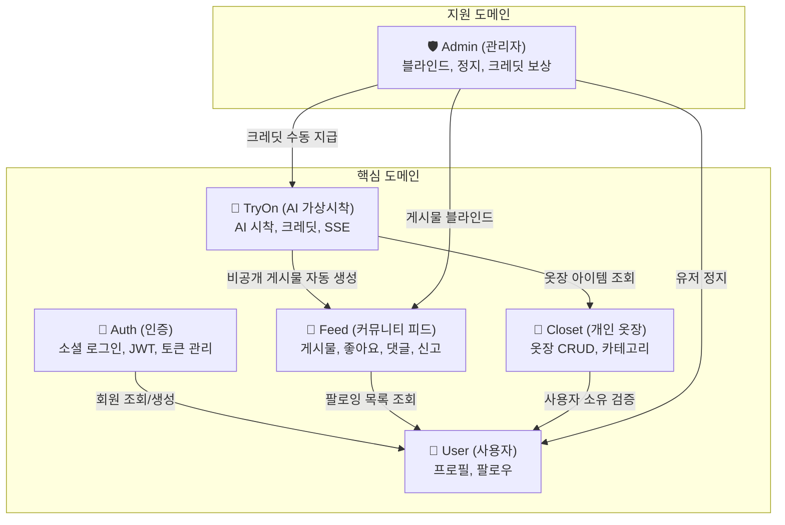

# Simul 백엔드 아키텍처 설계서

> **대상 독자**: 백엔드 개발자  
> **기준 문서**: `simul-functional-spec.md`, `simul-api-spec.md`, `simul-erd.md`, `simul_wbs.csv`  
> **아키텍처**: 헥사고날 아키텍처 (Ports & Adapters)

---

## 목차

1. [설계 원칙](#1-설계-원칙)
2. [도메인 분리](#2-도메인-분리)
3. [패키지 구조](#3-패키지-구조)
4. [도메인별 설계 상세](#4-도메인별-설계-상세)
5. [도메인 간 의존성 규칙](#5-도메인-간-의존성-규칙)
6. [공통 인프라](#6-공통-인프라)
7. [API ↔ UseCase 매핑](#7-api--usecase-매핑)
8. [구현 순서](#8-구현-순서)

---

## 1. 설계 원칙

### 헥사고날 아키텍처 — "안쪽"과 "바깥쪽"의 분리

```text
[Web Adapter] → [Input Port] ← [Application Service] → [Output Port] ← [Persistence Adapter]
  (Outside)     (Interface)        (Inside)              (Interface)       (Outside)

※ 화살표(→)는 "의존한다"를 의미. 양쪽 어댑터 모두 안쪽을 향해 의존합니다.
```

| 영역 | 역할 | 의존 대상 |
|------|------|----------|
| **Domain (Inside)** | 순수 비즈니스 규칙, 엔티티 | 아무것도 의존하지 않음 |
| **Application (Inside)** | UseCase 구현, 워크플로우 제어 | Domain + Port 인터페이스만 |
| **Adapter (Outside)** | 기술 구현 (Controller, JPA, 외부 API) | Port 인터페이스를 구현 |

**핵심 규칙:**
- 모든 의존성은 바깥에서 안쪽을 향한다
- DB가 바뀌어도(Adapter 수정), Application Service와 Domain은 수정하지 않는다
- 외부 서비스(AI API 등)는 Output Port 인터페이스로 추상화하여 구현체 교체가 자유롭다

---

## 2. 도메인 분리

Simul의 비즈니스를 **5개 핵심 도메인 + 1개 관리 도메인 + 1개 공통 모듈**로 분리한다.

> **Note:** Auth와 User는 WBS상 동일 Epic(인증/사용자, 담당자B)에 속하지만, "인증 기술"과 "사용자 비즈니스"는 변경 이유가 다르므로 패키지를 분리한다. 같은 담당자가 두 패키지를 모두 개발한다.



### 도메인별 책임 요약

| 도메인 | WBS Epic (접두사) | 담당자 | 소유 테이블 | 주요 비즈니스 규칙 |
|--------|------------------|--------|-----------|-------------------|
| **Auth (인증)** | 인증/사용자 (`AUTH-001~011`) | 담당자B | — (자체 테이블 없음, User의 Port를 통해 접근) | OAuth 검증, JWT 발급/갱신, 토큰 블랙리스트, 로그아웃 |
| **User (사용자)** | 인증/사용자 (`AUTH-012~024`) | 담당자B | `users`, `follows` | 프로필 CRUD, 팔로우/언팔로우, 사용자 게시물 목록, 소프트 딜리트(탈퇴) |
| **Closet (개인 옷장)** | 개인 옷장 (`CLOSET-`) | 담당자D | `closet_items`, `clothing_images` | 아이템 CRUD, 200개 상한 검증, Deep Copy, 소프트 딜리트, 카테고리 필터 |
| **TryOn (AI 가상시착)** | AI 가상시착 (`TRYON-`) | 담당자C | `base_images`, `tryon_credits` | 크레딧 일일 5회 제한, AI 비동기 생성, SSE 상태 스트림, 베이스 이미지 순환 등록 |
| **Feed (커뮤니티 피드)** | 커뮤니티 피드 (`FEED-`) | 담당자E | `posts`, `comments`, `likes`, `reports` | 게시물 공개/비공개, 좋아요 토글, 2-depth 댓글, 신고 5회 자동 블라인드 |
| **Admin (관리자)** | 관리자 (`ADMIN-`) | 담당자A | (자체 테이블 없음) | 게시물 강제 블라인드, 유저 정지, 크레딧 수동 지급 |
| **common (공통 인프라)** | 공통 인프라 (`INFRA-`) | 담당자A | — | 에러 코드, 보안, 이미지 업로드, 페이지네이션 |

---

## 3. 패키지 구조

```text
src/main/java/com/simul/
│
├── auth/                            # 🔐 인증 도메인 (담당자B)
│   ├── domain/model/                # SocialProvider enum
│   ├── application/
│   │   ├── port/in/                 # SocialLoginUseCase, RefreshTokenUseCase, LogoutUseCase
│   │   ├── port/out/               # LoadSocialUserPort, SaveTokenPort
│   │   ├── service/                # SocialLoginService
│   │   └── dto/                    # SocialLoginCommand, TokenResponse
│   └── adapter/
│       ├── in/web/                 # AuthController
│       │   └── dto/                # LoginRequest, LoginResponse
│       └── out/
│           ├── persistence/        # RefreshTokenJpaAdapter
│           └── oauth/              # KakaoOAuthAdapter, NaverOAuthAdapter, GoogleOAuthAdapter
│
├── user/                            # 👤 사용자 도메인 (담당자B)
│   ├── domain/model/                # User, Follow
│   ├── application/
│   │   ├── port/in/                 # GetProfileUseCase, UpdateProfileUseCase, DeleteUserUseCase,
│   │   │                            # FollowUseCase, GetUserPostsUseCase,
│   │   │                            # SuspendUserUseCase
│   │   ├── port/out/               # LoadUserPort, SaveUserPort, LoadFollowPort, SaveFollowPort,
│   │   │                            # LoadFollowingIdsPort, LoadUserPostsPort
│   │   ├── service/                # UserProfileService, FollowService
│   │   └── dto/                    # UpdateProfileCommand, UserProfileResponse
│   └── adapter/
│       ├── in/web/                 # UserController, FollowController
│       │   └── dto/                # UserRequest, UserResponse
│       └── out/persistence/        # UserPersistenceAdapter, FollowPersistenceAdapter
│
├── closet/                          # 👕 개인 옷장 도메인 (담당자D)
│   ├── domain/model/                # ClosetItem, ClothingImage, Category enum
│   ├── application/
│   │   ├── port/in/                 # AddItemUseCase, ListItemsUseCase, GetItemUseCase,
│   │   │                            # UpdateItemUseCase, DeleteItemUseCase,
│   │   │                            # CopyItemUseCase, IncrementTryCountUseCase
│   │   ├── port/out/               # SaveItemPort, LoadItemPort, SaveClothingImagePort
│   │   ├── service/                # ClosetService
│   │   └── dto/                    # AddItemCommand, ItemQuery, ItemResponse
│   └── adapter/
│       ├── in/web/                 # ClosetController
│       │   └── dto/                # ClosetItemRequest, ClosetItemResponse
│       └── out/
│           ├── persistence/        # ClosetPersistenceAdapter
│           └── vision/             # GoogleVisionAdapter (유사 이미지 검색)
│
├── tryon/                           # 🤖 AI 가상시착 도메인 (담당자C)
│   ├── domain/model/                # BaseImage, TryonCredit, TryonJob
│   ├── application/
│   │   ├── port/in/                 # GenerateTryonUseCase, UploadBaseImageUseCase,
│   │   │                            # CopyBaseImageFromPostUseCase, GetCreditsUseCase,
│   │   │                            # GetBaseImagesUseCase
│   │   ├── port/out/               # SaveBaseImagePort, LoadBaseImagePort,
│   │   │                            # SaveCreditPort, LoadCreditPort,
│   │   │                            # AiGenerationPort (⭐ AI 서비스 추상화)
│   │   ├── service/                # TryonService, CreditService, BaseImageService
│   │   └── dto/                    # GenerateTryonCommand, TryonStatusEvent
│   └── adapter/
│       ├── in/web/                 # TryonController (SSE endpoint 포함)
│       │   └── dto/                # TryonRequest, TryonResponse
│       └── out/
│           ├── persistence/        # TryonPersistenceAdapter
│           └── ai/                 # AiServiceAdapter (외부 AI API 구현체)
│
├── feed/                            # 📸 커뮤니티 피드 도메인 (담당자E)
│   ├── domain/model/                # Post, Comment, Like, Report
│   ├── application/
│   │   ├── port/in/                 # CreatePostUseCase, GetFeedUseCase, GetPostUseCase,
│   │   │                            # DeletePostUseCase, UpdatePostStatusUseCase,
│   │   │                            # ToggleLikeUseCase,
│   │   │                            # AddCommentUseCase, GetCommentsUseCase, DeleteCommentUseCase,
│   │   │                            # ReportPostUseCase, BlindPostUseCase
│   │   ├── port/out/               # SavePostPort, LoadPostPort, SaveLikePort,
│   │   │                            # SaveCommentPort, LoadCommentPort,
│   │   │                            # SaveReportPort, LoadReportPort
│   │   ├── service/                # PostService, LikeService,
│   │   │                            # CommentService, ReportService
│   │   └── dto/                    # CreatePostCommand, FeedQuery, CommentCommand
│   └── adapter/
│       ├── in/web/                 # PostController, CommentController
│       │   └── dto/                # PostRequest, PostResponse, CommentRequest
│       └── out/persistence/        # PostPersistenceAdapter, LikePersistenceAdapter,
│                                    # CommentPersistenceAdapter, ReportPersistenceAdapter
│
├── admin/                           # 🛡️ 관리자 도메인 (담당자A)
│   ├── application/
│   │   ├── port/in/                 # GetReportsUseCase
│   │   └── service/                # AdminService
│   └── adapter/
│       └── in/web/                 # AdminController
│
└── common/                          # 🔧 공통 인프라 (담당자A)
    ├── config/                      # SecurityConfig, JpaConfig, CorsConfig, WebConfig
    ├── exception/                   # GlobalExceptionHandler, BusinessException, ErrorCode enum
    ├── security/                    # JwtTokenProvider, JwtAuthenticationFilter
    ├── storage/                     # FileStorageService (S3/GCS 업로드 추상화)
    ├── image/                       # ImageValidator (포맷/용량/해상도 검증 유틸리티)
    └── dto/                         # PageRequest, PageResponse (공통 페이지네이션)
```

---

## 4. 도메인별 설계 상세

### 4-1. Auth 도메인 (인증)

Auth 도메인은 소셜 로그인과 JWT 토큰 관리만 담당한다. 사용자 데이터 접근은 User 도메인의 Port를 통해 처리한다.

**소셜 로그인 흐름:**

```text
[AuthController] POST /auth/social
    │
    ▼
[SocialLoginService] (implements SocialLoginUseCase)
    ├── LoadSocialUserPort → KakaoOAuthAdapter (카카오에서 사용자 정보 조회)
    │                      → NaverOAuthAdapter / GoogleOAuthAdapter
    ├── User 도메인의 LoadUserPort → 기존 회원 여부 확인
    │   └── 미가입 시 User 도메인의 SaveUserPort → 자동 회원가입
    ├── JWT 발급 (JwtTokenProvider)
    └── SaveTokenPort → Refresh Token DB 저장
```

*Note: Auth는 `users` 테이블을 직접 소유하지 않고, User 도메인이 제공하는 `LoadUserPort`/`SaveUserPort`를 통해 접근한다.*

---

### 4-2. User 도메인 (사용자)

User 도메인은 사용자 프로필 관리와 팔로우 관계를 담당한다.

**사용자 게시물 목록 조회:**

`GET /users/{userId}/posts`는 User 도메인이 소유한다. 게시물 데이터는 Feed 도메인의 `LoadPostPort`를 통해 조회하되, 공개/비공개 분기 판단(본인 vs 타인)은 User 도메인의 UserProfileService에서 처리한다.

---

### 4-3. TryOn 도메인 (AI 가상시착)

**AI 시착 생성 흐름:**

```text
[TryonController] POST /tryon/generate
    │
    ▼
[TryonService] (implements GenerateTryonUseCase)
    │ ① LoadCreditPort → 오늘 크레딧 잔여 확인 (0이면 ERR-103-A)
    │ ② LoadBaseImagePort → 베이스 이미지 존재 확인
    │ ③ Closet 도메인의 LoadItemPort → 옷장 아이템 존재 확인
    │ ④ Feed 도메인의 CreatePostUseCase → 비공개 게시물(status=processing) 자동 생성
    │ ⑤ AiGenerationPort → 외부 AI 서비스에 생성 요청
    │ ⑥ (비동기 완료 시)
    │     SaveCreditPort → 크레딧 1 차감
    │     Feed 도메인의 UpdatePostStatusUseCase → 결과 이미지 URL 업데이트, status=completed
    │     Closet 도메인의 IncrementTryCountUseCase → try_count 증가
```

**AI 서비스 추상화 — 헥사고날의 핵심 가치:**

AI 서비스는 Output Port 인터페이스로 추상화하므로 제공업체가 바뀌어도 `AiServiceAdapter` 구현체만 교체하면 된다. Application Service와 Domain은 전혀 수정할 필요 없다.

```text
AiGenerationPort (인터페이스, Inside)
    ├── submitGeneration(userImageUrl, clothingImageUrl) → jobId
    └── checkStatus(jobId) → TryonStatusEvent

AiServiceAdapter (구현체, Outside)
    └── 실제 외부 AI API 호출 로직
```

**크레딧 비즈니스 규칙:**
- 일일 무료 시착 5회 제한 (KST 00:00 기준 리셋)
- 생성 **성공** 시에만 1회 차감, 실패 시 미차감
- `tryon_credits` 테이블에 사용 이력 기록 (`used_at` 기준 당일 카운트)

---

### 4-4. Feed 도메인 (커뮤니티 피드)

**피드 조회 (필터링 & 페이지네이션):**
- `tab=all | following` — following 탭은 User 도메인의 `LoadFollowingIdsPort`를 통해 팔로잉 목록을 조회한 후 필터링
- `sort=recent | popular` — popular는 `like_count` 내림차순
- 블라인드 처리된 게시물(`is_blinded=true`)은 피드에서 제외
- 비공개 게시물(`is_public=false`)은 본인 프로필에서만 노출

**신고 자동 블라인드 로직:**

```text
[PostController] POST /posts/{postId}/report
    │
    ▼
[ReportService] (implements ReportPostUseCase)
    ├── 중복 신고 확인 (동일 reporter + post → ERR-401-A)
    ├── SaveReportPort → 신고 저장
    ├── report_count 증가
    └── if (report_count >= 5) → is_blinded = true (자동 블라인드)
```

---

### 4-5. Closet 도메인 (개인 옷장)

```text
[ClosetController]
    ├─ POST   /closet/items → [AddItemUseCase] → ClosetService
    │                          ├── 200개 상한 검증 (LoadItemPort.countByUserId)
    │                          ├── ClothingImage 저장 (SaveClothingImagePort)
    │                          └── ClosetItem 저장 (SaveItemPort)
    │
    ├─ GET    /closet/items → [ListItemsUseCase] → ClosetService → LoadItemPort
    │                          (카테고리 필터, 정렬, 페이지네이션)
    │
    ├─ GET    /closet/items/{id} → [GetItemUseCase]
    ├─ PATCH  /closet/items/{id} → [UpdateItemUseCase] (소유권 검증)
    └─ DELETE /closet/items/{id} → [DeleteItemUseCase] (소프트 딜리트: deleted_at)
```

**Google Vision API 연동 (Should):**

유사 이미지 검색은 `closet/adapter/out/vision/GoogleVisionAdapter`에서 처리한다. DB 저장 없이 일회성 결과만 반환한다.

---

### 4-6. Admin 도메인 (관리자)

Admin은 자체 도메인 모델 없이, 타 도메인이 제공하는 **Input Port**를 호출하여 운영 기능을 수행한다.

```text
AdminService
    ├── BlindPostUseCase       → Feed 도메인이 제공
    ├── SuspendUserUseCase     → User 도메인이 제공 (is_active=false 처리)
    ├── GrantCreditUseCase     → TryOn 도메인이 제공
    └── GetReportsUseCase      → Feed 도메인이 제공
```

---

## 5. 도메인 간 의존성 규칙

### 테이블 소유자 원칙

각 DB 테이블은 **단일 도메인만 소유**한다. 타 도메인은 반드시 소유 도메인의 Port 인터페이스를 통해 접근한다.

| DB 테이블 | 소유 도메인 | 접근 도메인 | 접근 방식 |
|-----------|-----------|-----------|----------|
| `users` | User | Auth | User의 `LoadUserPort` / `SaveUserPort` 사용 |
| `follows` | User | Feed | User의 `LoadFollowingIdsPort` 사용 |
| `closet_items` | Closet | TryOn | Closet의 `LoadItemPort` / `IncrementTryCountUseCase` 사용 |
| `clothing_images` | Closet | TryOn | Closet의 `LoadItemPort`를 통해 간접 접근 |
| `posts` | Feed | TryOn, User | Feed의 `CreatePostUseCase` / `UpdatePostStatusUseCase` / `LoadPostPort` 사용 |
| `base_images` | TryOn | — | 단독 소유 |
| `tryon_credits` | TryOn | Admin | TryOn의 `GrantCreditUseCase` 사용 |
| `comments` | Feed | — | 단독 소유 |
| `likes` | Feed | — | 단독 소유 |
| `reports` | Feed | Admin | Feed의 `GetReportsUseCase` 사용 |

### 교차 도메인 접근 시 반드시 지킬 규칙

1. **타 도메인의 Output Port를 직접 의존하지 않는다** — 반드시 소유 도메인의 Input Port(UseCase)를 통해 접근한다
2. **JPA Entity와 Repository는 소유 도메인 담당자만 수정**한다
3. **common/ 변경(ErrorCode 추가, SecurityConfig 변경)은 전원 리뷰**한다

---

## 6. 공통 인프라

### 에러 코드 체계

`simul-api-spec.md`에 정의된 에러 코드를 `ErrorCode` enum으로 매핑한다.

| ErrorCode 상수 | 에러 코드 | HTTP Status | 메시지 |
|---------------|-----------|-------------|--------|
| `UNKNOWN_ERROR` | `ERR-000` | 500 | 일시적인 오류가 발생했어요. |
| `UNAUTHORIZED` | `ERR-001` | 401 | 인증이 필요합니다. |
| `FORBIDDEN` | `ERR-002` | 403 | 접근 권한이 없어요. |
| `NOT_FOUND` | `ERR-003` | 404 | 찾을 수 없는 콘텐츠예요. |
| `IMAGE_UPLOAD_FAIL` | `ERR-101` | 500 | 사진 업로드에 실패했어요. |
| `CREDIT_EXHAUSTED` | `ERR-103-A` | 422 | 오늘 무료 시착을 모두 사용했어요. |
| `AI_GENERATION_FAIL` | `ERR-103-B` | 500 | 시착 생성에 실패했어요. |
| `AI_TIMEOUT` | `ERR-103-C` | 408 | 생성 시간이 초과됐어요. |
| `UNSAFE_IMAGE` | `ERR-103-D` | 422 | 사용할 수 없는 이미지예요. |
| `CLOSET_FULL` | `ERR-201-A` | 422 | 옷장이 가득 찼어요 (최대 200개). |
| `ITEM_IMAGE_TOO_BIG` | `ERR-201-B` | 422 | 이미지는 10MB 이하만 가능해요. |
| `POST_IMAGE_TOO_BIG` | `ERR-301-B` | 422 | 이미지는 20MB 이하만 가능해요. |
| `DUPLICATE_REPORT` | `ERR-401-A` | 422 | 이미 신고한 게시물이에요. |

### 보안 설정

```text
인증 흐름:
  Request → JwtAuthenticationFilter → SecurityContext 인증 정보 저장 → Controller

인증 불필요 API:
  POST /auth/social, POST /auth/refresh
  GET  /posts (피드 열람), GET /posts/{post_id} (게시물 상세)
  GET  /users/{user_id} (프로필 열람)

Admin 전용 API:
  /admin/** → role=admin 검증
```

---

## 7. API ↔ UseCase 매핑

| API | 도메인 | Controller | Input Port (UseCase) |
|-----|--------|-----------|---------------------|
| `POST /auth/social` | Auth | AuthController | SocialLoginUseCase |
| `POST /auth/refresh` | Auth | AuthController | RefreshTokenUseCase |
| `DELETE /auth/logout` | Auth | AuthController | LogoutUseCase |
| `GET /users/me` | User | UserController | GetProfileUseCase |
| `PATCH /users/me` | User | UserController | UpdateProfileUseCase |
| `DELETE /users/me` | User | UserController | DeleteUserUseCase |
| `GET /users/{userId}` | User | UserController | GetProfileUseCase |
| `GET /users/{userId}/posts` | User | UserController | GetUserPostsUseCase |
| `POST /follows/{userId}` | User | FollowController | FollowUseCase |
| `DELETE /follows/{userId}` | User | FollowController | FollowUseCase |
| `GET /closet/items` | Closet | ClosetController | ListItemsUseCase |
| `POST /closet/items` | Closet | ClosetController | AddItemUseCase |
| `GET /closet/items/{itemId}` | Closet | ClosetController | GetItemUseCase |
| `PATCH /closet/items/{itemId}` | Closet | ClosetController | UpdateItemUseCase |
| `DELETE /closet/items/{itemId}` | Closet | ClosetController | DeleteItemUseCase |
| `GET /users/me/base-images` | TryOn | TryonController | GetBaseImagesUseCase |
| `POST /tryon/base-images` | TryOn | TryonController | UploadBaseImageUseCase |
| `POST /tryon/base-images/from-post` | TryOn | TryonController | CopyBaseImageFromPostUseCase |
| `POST /tryon/generate` | TryOn | TryonController | GenerateTryonUseCase |
| `GET /tryon/status/{jobId}` | TryOn | TryonController | GetTryonStatusUseCase |
| `GET /tryon/credits` | TryOn | TryonController | GetCreditsUseCase |
| `GET /posts` | Feed | PostController | GetFeedUseCase |
| `POST /posts` | Feed | PostController | CreatePostUseCase |
| `GET /posts/{postId}` | Feed | PostController | GetPostUseCase |
| `DELETE /posts/{postId}` | Feed | PostController | DeletePostUseCase |
| `POST /posts/{postId}/likes` | Feed | PostController | ToggleLikeUseCase |
| `GET /posts/{postId}/comments` | Feed | CommentController | GetCommentsUseCase |
| `POST /posts/{postId}/comments` | Feed | CommentController | AddCommentUseCase |
| `DELETE /comments/{commentId}` | Feed | CommentController | DeleteCommentUseCase |
| `POST /posts/{postId}/report` | Feed | PostController | ReportPostUseCase |
| `GET /admin/reports` | Admin | AdminController | GetReportsUseCase |
| `PATCH /admin/posts/{postId}/blind` | Admin | AdminController | BlindPostUseCase |
| `PATCH /admin/posts/{postId}/unblind` | Admin | AdminController | BlindPostUseCase |
| `PATCH /admin/users/{userId}/suspend` | Admin | AdminController | SuspendUserUseCase |
| `POST /admin/users/{userId}/credits` | Admin | AdminController | GrantCreditUseCase |

---

## 8. 도메인 간 Port 인터페이스 계약

도메인 간 통신은 반드시 아래 Port 인터페이스를 통해 이루어진다. 각 도메인 개발 착수 전에 시그니처를 합의해야 한다.

| 제공 도메인 | 인터페이스 | 사용 도메인 | 용도 |
|-----------|-----------|-----------|------|
| User | `LoadUserPort`, `SaveUserPort` | Auth, Closet, Feed | 회원 조회/생성, 소유권 검증, 작성자 정보 |
| User | `LoadFollowingIdsPort` | Feed | following 탭 피드 필터링 |
| User | `SuspendUserUseCase` | Admin | 유저 정지 |
| Closet | `LoadItemPort` | TryOn | 시착할 옷 조회 |
| Closet | `IncrementTryCountUseCase` | TryOn | try_count 증가 |
| Feed | `CreatePostUseCase` | TryOn | 비공개 게시물 자동 생성 |
| Feed | `UpdatePostStatusUseCase` | TryOn | 시착 완료 시 결과 업데이트 |
| Feed | `LoadPostPort` | User | 사용자 게시물 목록 조회 |
| Feed | `BlindPostUseCase` | Admin | 게시물 강제 블라인드 |
| Feed | `GetReportsUseCase` | Admin | 신고 목록 조회 |
| TryOn | `GrantCreditUseCase` | Admin | 크레딧 수동 지급 |
