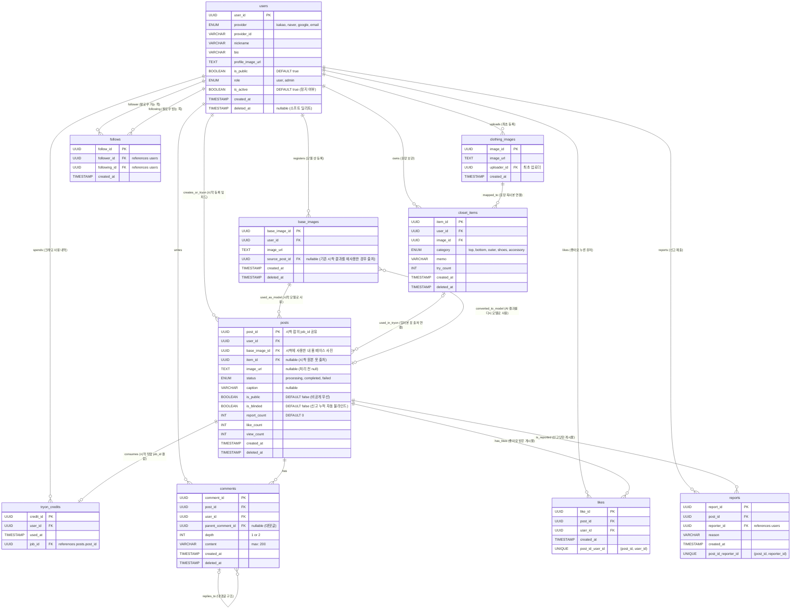

# Simul ERD (Entity-Relationship Diagram)

> **기준 문서**: `simul-functional-spec.md`, `simul-api-spec.md`  
> **기능 변경 반영 목록**: 가상 시착용 베이스 사람 이미지(`base_images`) 영구 보관 및 AI 시착 결과를 베이스 이미지로 재사용하는 순환 로직 추가.

## 시각화 다이어그램 (Mermaid)
이 다이어그램은 Github Markdown이나 최신 Markdown 뷰어에서 자동으로 다이어그램 맵으로 변환되어 출력됩니다.

## 신규 도입된 설계 포인트 (베이스 이미지 순환 구조)
1. **`base_images` 테이블 분리 확장**: 사용자가 AI 가상시착에 사용하는 "내 몸 모델(Base Image)" 사진들을 DB에 온전히 기록하여 관리합니다.
2. **시착 결과를 다시 내 모델로 사용(`source_post_id`)**: 단순히 갤러리에서 새로 올리는 것뿐만 아니라, 과거에 너무 만족스럽게 합성된 '시착 완료 사진(`posts`)' 자체를 다음 시착의 내 몸 모델 사진으로 그대로 승계등록할 수 있도록 FK 자기 참조 흐름 구조를 확립했습니다.
